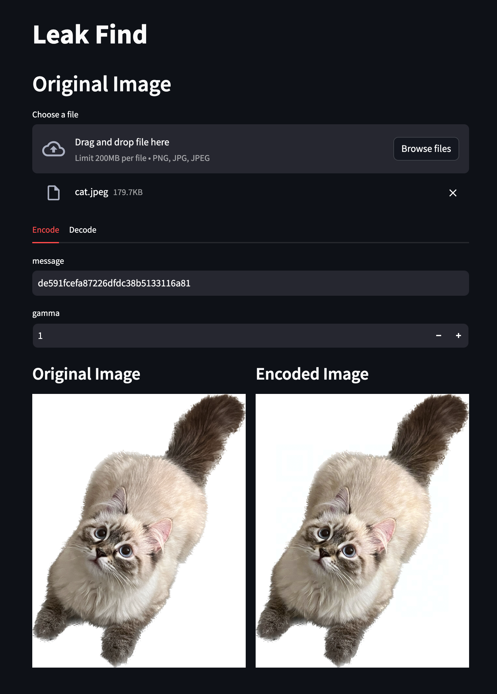
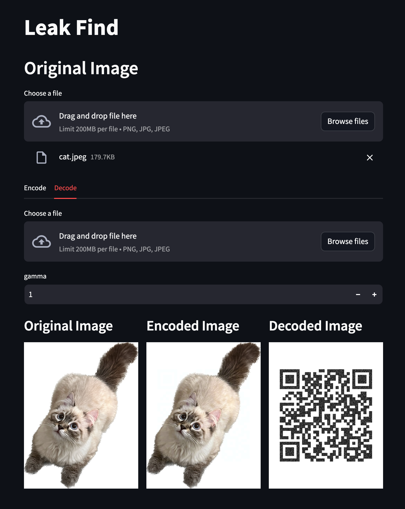

# Leak Find

* Demo: https://leak-find.streamlit.app/

Leak Find is a tool to embed secret messages into an image.
It can help you claim your legal right if someone re-distribute your photos on social media without your permission.
You can use the demo website or run the python code locally.
The detailed steps are explained as following.

#### Encode

1. Upload the original image.
2. Enter a message or use the randomly generated message.
3. Download the encoded image.



#### Decode

1. Upload the original image (optional)
2. Upload the encoded image (optional)
3. Get the decoded QR code



## Usage:

### Encode

```
./encoder.py
usage: encoder.py [-h] [-m MESSAGE] [-g GAMMA] filename
```
* `filename`: the original image file
* `-m`: the message to be encoded in the image
* `-g`: how much do you want to distort the image

### Decode

```
./decoder.py
usage: decoder.py [-h] [-g GAMMA] filename masked_filename
```

* `filename`: the original image file
* `masked_filename`: the encoded image file
* `-g`: the threshold used to find the difference

## Contributions

If you have any questions or want to learn more about this research, please open an issue or send a mail to the following address.

* Po-Chu Hsu: tonypottera[at]gmail.com

## License

This project is licensed under the MIT License - see the LICENSE.txt file for details